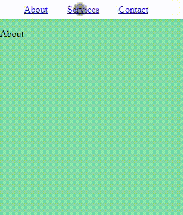

# CSS Learning Initiative
It's a self-made initiative to learning more features of CSS.

#### Resources
- https://caniuse.com/ (a tool for checking the compatibility of CSS properties with browsers)

### Week 1 - Scroll-Smooth: 
*Method of specifying the scrolling behavior for a scrolling box, when scrolling happens due to navigation or CSSOM scrolling APIs.*
[source](https://caniuse.com/?search=scroll-behavior)


My feature:




##### Details:
After use href to link section in your main content, you may just use this css selector and property:


```
html{
    scroll-behavior: smooth;
}
```


### Week 2:  Focus Within   
*The :focus-within pseudo-class matches elements that either themselves match :focus or that have descendants which match :focus.*
[source](https://caniuse.com/?search=focus-within)


My Feature:


##### Details:
First, I removed all properties by default of the textarea tag, then I added in form selector on css: 


```
form:focus-within{
  border: 2px solid #76F5AA;
}
```

The idea of Focus-Within, instead of Focus, is use Focus effect to father elements too.
